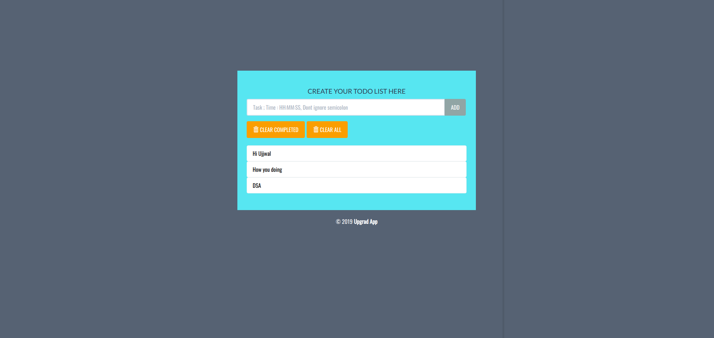
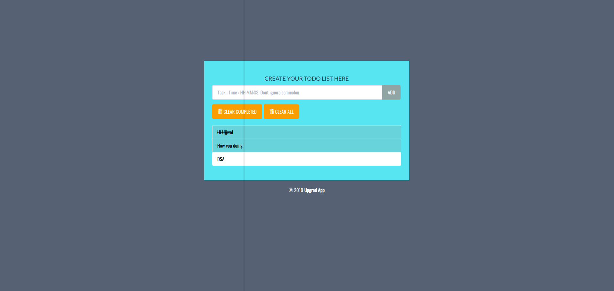
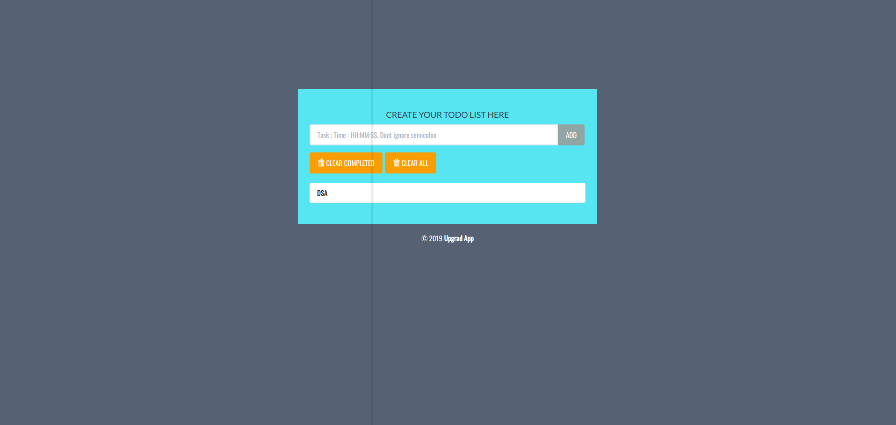
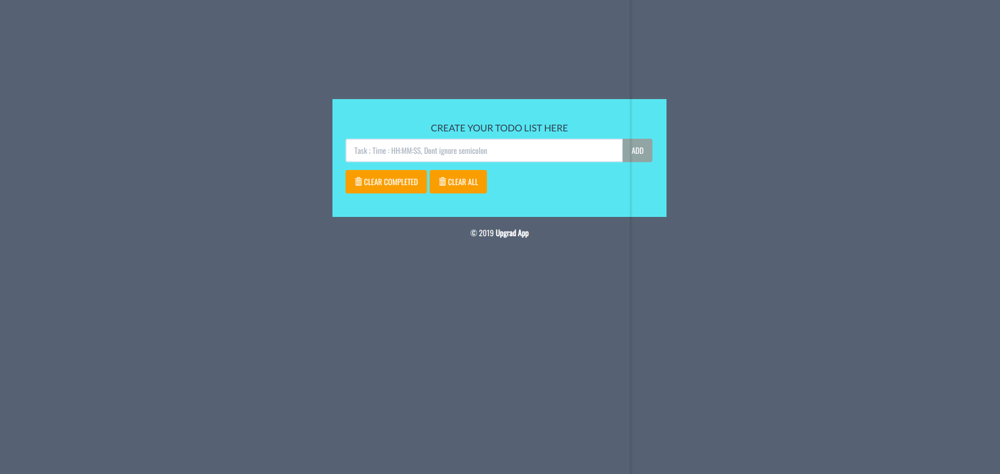

# TODO_APP
It is a app in whuch you can add your data to priortise your work according to your need, It is less with many features like auto maiing and reminders on your email and google calender about specific events you have scheduled, You can view, add , delete the tasks etc.

# GOOGLE APIs

The mailing system is bit complex because I have used the GOOGLE APIs to connect mailing system to the app. It can be very easily implemented with the django.core.mail but it is clearly mentioned that I need to use apis.

# Technology Stack

I have used bash scripting, google scripting, html/css, and DJANGO.

# How to run

In order to make it convient to use for everyone, I have provided the requirements.html which consist of dependencies that need to be downloaded before starting the app.
After that just go to the clone folder, do data migrations and run the app.

# OVERVIEW
# Intial veiw

# After marking the completed task

# Clearing completed task

# Clearing all task

# Mailing and reminders 
In order to do mailing and reminders, all you need to do is just create your crendentials by making google drive api project on console.developer.google.com,
Add that json file to the cloned folder and name it as upgrad.json. If all things are done right, your todo app will be connected with your mail as well as with your calender.

Also Included the docker file of this project for easy to use.
